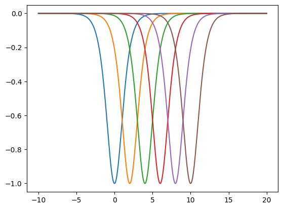
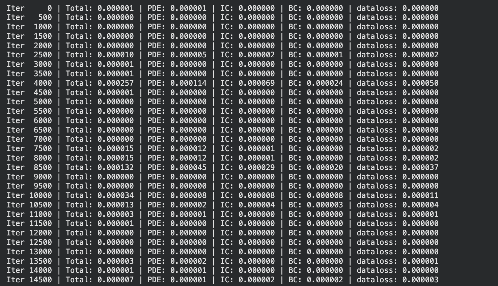

# Solving the KdV Equation using Physics-Informed Neural Networks

This project solves the Korteweg-de Vries (KdV) equation using a Physics-Informed Neural Network (PINN) and recovers the travelling wave (soliton) solution. We explore two approaches: physics-only and data-augmented.

Done as preliminary/informal work under **Prof. Snehanshu Saha**, BITS Pilani Goa.

**By:** Soham Pujari (2024A7PS0490G) and Nirek Agarwal (2024A7PS0581G)

---

## What is this?

The KdV equation describes how waves travel in shallow water. It has a special solution called a **soliton** — a wave that moves without changing shape, because the nonlinear steepening and dispersive spreading perfectly cancel each other out.

The equation (Section 4 sign convention from the reference paper):

```
∂u/∂t − 6u·∂u/∂x + ∂³u/∂x³ = 0
```

The exact soliton solution (Eq. 4.3 from the paper):

```
u(x,t) = −c / [2·cosh²(½√c · (x − ct))]
```

We pick `c = 2`, which gives a wave of depth 1 moving at speed 2.

> **Note on the sign convention:** The solution is negative (a trough, not a peak) because we follow the Section 4 convention of the paper, which uses `−6u·∂u/∂x`. Section 2 of the same paper uses `+6u·∂u/∂x` and gives a positive soliton. The two are related by `u → −u`. Mixing conventions between the PDE and the initial condition will cause training to fail silently — this is a common pitfall.

---

## Two approaches

### Approach 1: Physics-only
The network learns from three losses:
- **PDE loss** — does the network's output satisfy the KdV equation?
- **IC loss** — does it match the known soliton shape at `t=0`?
- **BC loss** — is it zero at the domain edges?

No data. The equation is the teacher.

### Approach 2: Physics + Data
Same as above, plus:
- **Data loss** — 200 synthetic measurement points scattered across the domain, computed from the exact solution

This simulates having sparse sensor readings in a real-world scenario. The physics fills gaps between sensors, the sensors anchor the physics.

---

## Our workflow

Built step by step, verifying each piece before moving on.

### 1. Exact solution
Coded the soliton formula, plotted at `t=0` to verify the shape, then at multiple times to confirm the wave slides right at speed 2 without changing shape.




### 2. Neural network
Fully connected: 2 inputs → 6 hidden layers of 50 neurons with tanh → 1 output. Xavier initialization.

### 3. Derivatives
Computed `∂u/∂t`, `∂u/∂x`, `∂³u/∂x³` via PyTorch autograd. **Verified independently** against finite differences `(f(x+h) - f(x-h)) / 2h`. Max difference ~0.001.


### 4. Physics-only training
Adam (15,000 iter) → L-BFGS (2,000 iter).

**Result:** L2 error = **0.98%**


Error grows at later times because the network has no guidance beyond `t=0`.

### 5. Data-augmented training
Added 200 synthetic data points across the domain. Retrained with the same Adam + L-BFGS procedure.

**Result:** L2 error = **0.07%**




Error is now uniform across all times. The late-time drift is gone.

### 6. Conservation check
`∫u dx` stays constant (~-2.83) across all timesteps in both approaches. The network learned a conservation law we never told it about.

---

## Results summary

| Metric | Physics-only | Physics + Data |
|---|---|---|
| L2 Relative Error | 0.98% | **0.07%** |
| Total Loss | ~10⁻⁷ | ~10⁻⁷ |
| Max pointwise error | ~0.02 | ~0.006 |
| Conservation variation | 0.4% | 0.2% |

Adding 200 data points improved accuracy by ~14x. Physics and data are complementary — neither alone is as good as both together.

---

## Repo structure

```
├── KdV_using_PINNs_final.ipynb    # the notebook (run top to bottom in Colab with T4 GPU)
├── README.md
├── 11_Schalch.pdf                  # reference paper
└── screenshots/
    ├── soliton_t0.png
    ├── soliton_propogation.png
    ├── derivative_check.png
    ├── adam_results.png
    ├── adam_heatmap.png
    ├── adam_loss.png
    ├── adam_iterations.png
    ├── lbfgs_results.png
    ├── lbfgs_heatmap.png
    ├── lbfgs_iterations.png
    ├── pinn_architecture.png
    ├── new_data_loss_fxn_added.png
    ├── new_losses.png
    ├── new_adam_re.png
    ├── new_adam_heat.png
    ├── new_lfbgs.png
    ├── post_new_adam.png
    ├── final_plot.png
    ├── final_heat.png
    ├── final_losses_print.png
    ├── final_L2.png
    ├── final_check.png
    └── dataloss_colo_points.png
```

---

## How to run

1. Open `KdV_using_PINNs_final.ipynb` in Google Colab
2. Go to Runtime → Change runtime type → T4 GPU
3. Run all cells top to bottom
4. Training takes ~15-20 minutes total (Adam + L-BFGS)

---

## Reference

Schalch, N. (2018). *The Korteweg-de Vries Equation.* ETH Zürich Proseminar: Algebra, Topology and Group Theory in Physics.

We used the soliton solution from Eq. 4.3 (Section 4 sign convention) and `c = 2`.
