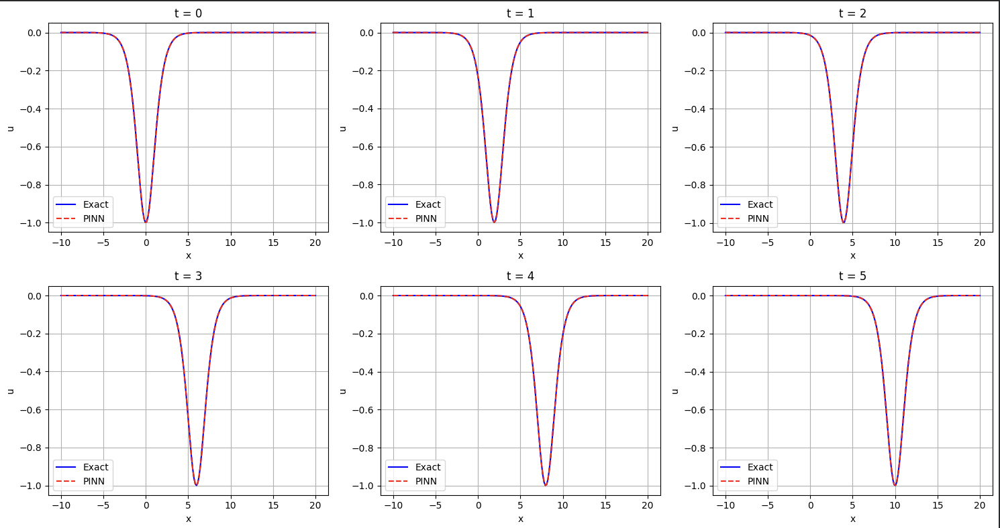
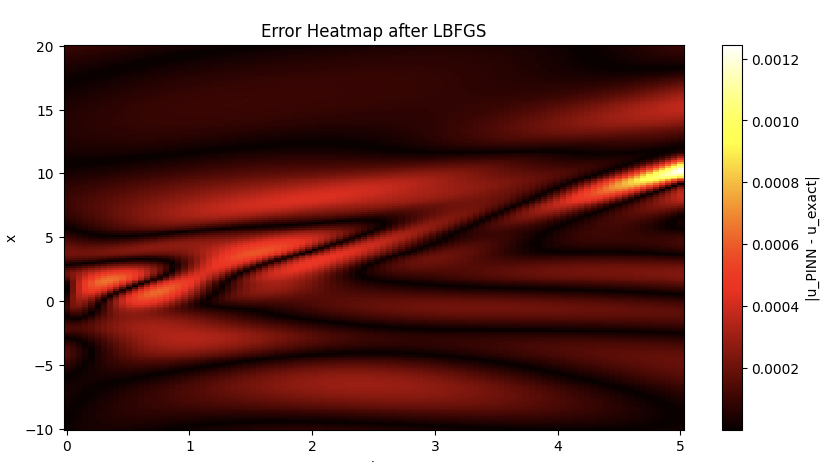
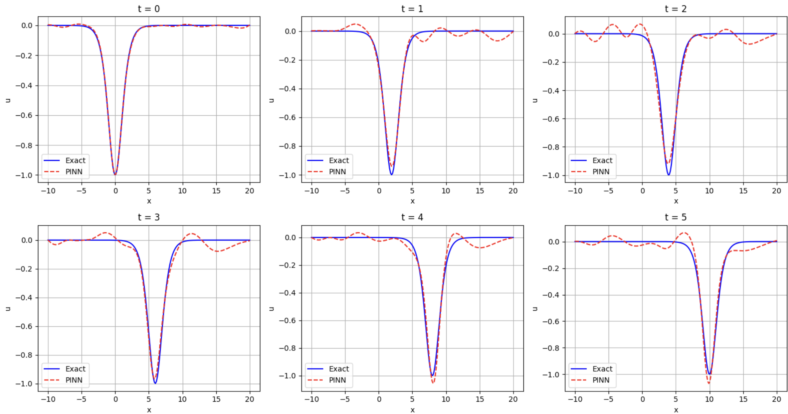
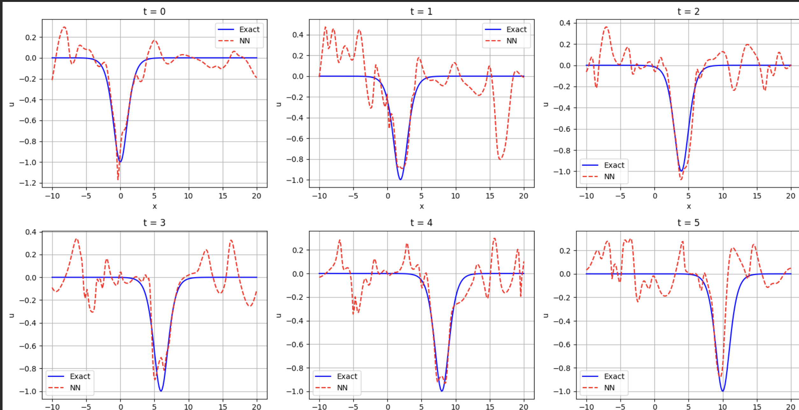
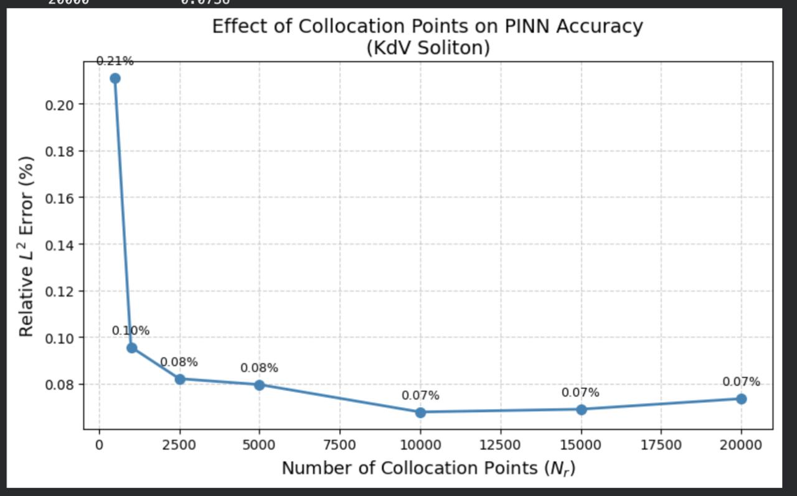
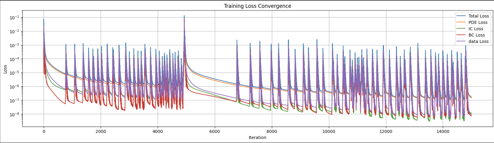

# Solving the KdV Equation using Physics-Informed Neural Networks

We solve the Korteweg–de Vries (KdV) equation with a PINN, then run four experiments to figure out what actually matters when deploying PINNs on wave problems: noise, collocation density, initial conditions, and wave speed.

Done as preliminary work under **Prof. Snehanshu Saha**, BITS Pilani Goa.

**By:** Soham Pujari (2024A7PS0490G) and Nirek Agarwal (2024A7PS0581G)

---

## The problem

The KdV equation describes shallow water waves. It has a special solution called a **soliton** — a wave that moves without changing shape.

```
∂u/∂t − 6u·∂u/∂x + ∂³u/∂x³ = 0
```

Exact soliton (Section 4 sign convention from Schalch):

```
u(x,t) = −c / [2·cosh²(½√c · (x − ct))]
```

We use `c = 2` (peak depth = −1, speed = 2) as our default.

> **Sign convention note:** The soliton is negative (a trough) because we follow the Section 4 convention with `−6u·∂u/∂x`. The Section 2 convention uses `+6u·∂u/∂x` and gives a positive soliton. They're related by `u → −u`. Mixing them will cause silent training failure.

---

## What we did

### Baseline: Physics + Data PINN

The network learns from four losses:
- **PDE loss** — does the output satisfy KdV? (10,000 collocation points)
- **IC loss** — does it match the soliton at `t=0`? (500 points)
- **BC loss** — is it zero at `x = −10` and `x = 20`? (100 points per edge)
- **Data loss** — does it match 200 scattered synthetic measurements?

Architecture: 2 inputs `(x, t)` → 6 hidden layers × 50 neurons, tanh → 1 output `u(x,t)`.

Training: Adam (15,000 iter) → L-BFGS (2,000 iter).

**Baseline result: L² error = 0.0717%**





Conservation of mass (`∫u dx`) holds to within 0.4% across all timesteps — and we never enforced it.

---

### Experiment 1: Noisy data

We added Gaussian noise (1%, 5%, 10%) to the 200 data points and compared the PINN against a data-only neural network (same architecture, no physics).

| Noise | PINN (best) | Data-only NN (best) | PINN advantage |
|-------|-------------|---------------------|----------------|
| 0%    | 0.07%       | 1.20%               | 17× |
| 1%    | 0.83%       | 11.1%               | 13× |
| 5%    | 5.51%       | 38.8%               | 7×  |
| 10%   | 12.2%       | 54.7%               | 4.5× |

The PDE acts as a noise filter. The data-only network overfits the noise completely:

**PINN at 10% noise:**



**Data-only NN at 10% noise (same data):**



**Unexpected finding:** L-BFGS fine-tuning *hurts* the PINN under noise (e.g., 5.5% → 6.8% at 5% noise) because it aggressively overfits corrupted data. The data-only model doesn't have this problem. When data is noisy, stick with Adam.

---

### Experiment 2: Collocation point density

How many PDE enforcement points do you actually need?

| N_r    | L² error |
|--------|----------|
| 500    | 0.21%    |
| 1,000  | 0.10%    |
| 2,500  | 0.08%    |
| 5,000  | 0.08%    |
| 10,000 | 0.07%    |
| 15,000 | 0.07%    |
| 20,000 | 0.07%    |

Saturates around 5,000. Even 500 gives 0.21%. More than 15,000 is wasteful.



---

### Experiment 3: Dropping the initial condition

Can 200 scattered measurements replace knowing the starting state?

| Config | L² error |
|--------|----------|
| With IC (full PINN) | 0.072% |
| Without IC (PDE + BC + data only) | 0.077% |

Yes. The data points implicitly contain IC information, and the PDE fills in the rest.

---

### Experiment 4: Different wave speeds

Same architecture, same domain `[−10, 20] × [0, 5]`, different `c`.

| c | Peak depth | L² error |
|---|------------|----------|
| 1 | −0.5 | 0.07% |
| 2 | −1.0 | 0.07% |
| 4 | −2.0 | 29.5% |

`c = 4` fails because (1) gradients are twice as steep, and (2) the soliton hits the boundary at `t = 5`. Fix: wider domain or shorter time window.



---

## Key takeaways

1. **The PDE is the backbone.** It denoises, compensates for missing ICs, and works with sparse enforcement. If you know the physics, use it.
2. **L-BFGS is dangerous with noisy data.** It overfits noise in PINNs (but not in data-only models). Use Adam-only when noise is present.
3. **You don't always need the initial condition.** Sparse measurements + PDE + BCs can reconstruct the full solution.
4. **Scale your setup to your physics.** Steeper/faster waves need wider domains and possibly deeper networks.

---

## Repo structure

```
├── screenshots/                        # all figures used in the report
├── KdV_using_PINNs (5).ipynb          # baseline PINN notebook
├── pinn_with_noise.ipynb              # Experiment 1: PINN with noisy data
├── purely_data_driven_with_noise.ipynb # Experiment 1: data-only control
├── noIC (2).ipynb                     # Experiment 3: no initial condition
├── _c=1.ipynb                         # Experiment 4: wave speed c=1
├── _c=4.ipynb                         # Experiment 4: wave speed c=4
├── README.md

```

Experiment 2 (collocation points) is run inside the baseline notebook with a loop over `n_pde` values.

---

## How to run

1. Open any notebook in [Google Colab](https://colab.research.google.com/)
2. Runtime → Change runtime type → **T4 GPU**
3. Run all cells top to bottom
4. Training takes ~15–20 minutes per notebook

---

## Reference

Schalch, N. (2018). *The Korteweg–de Vries Equation.* ETH Zürich Proseminar: Algebra, Topology and Group Theory in Physics.

Raissi, M., Perdikaris, P., & Karniadakis, G.E. (2019). *Physics-informed neural networks.* J. Comput. Phys., 378, 686–707.
