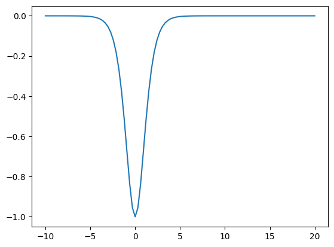
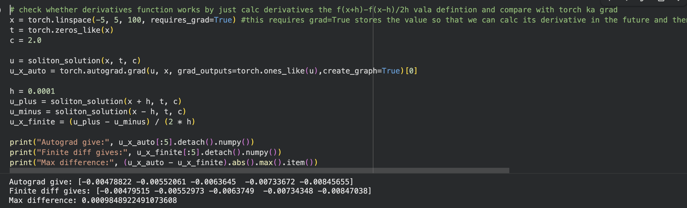
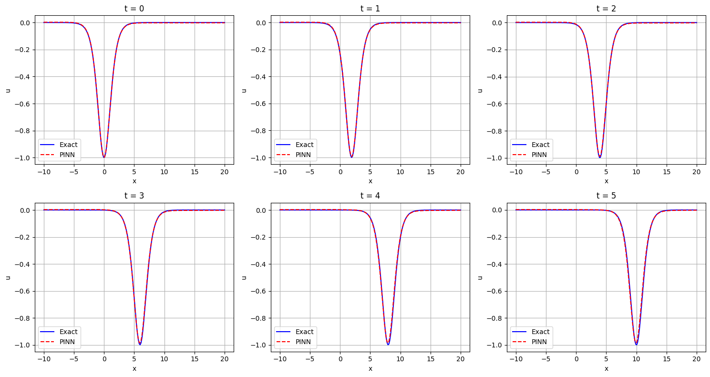
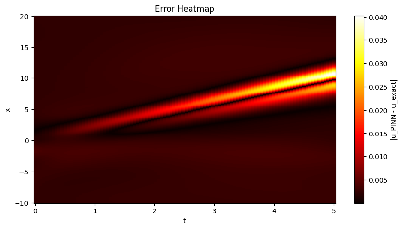
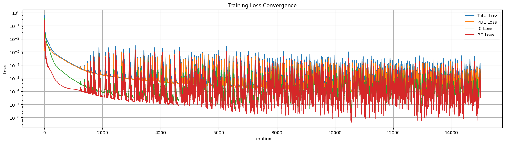
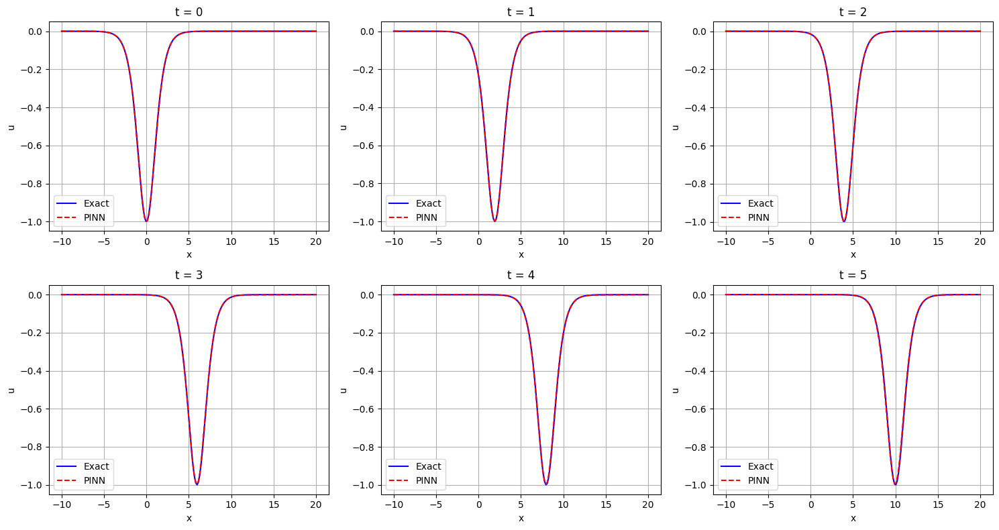
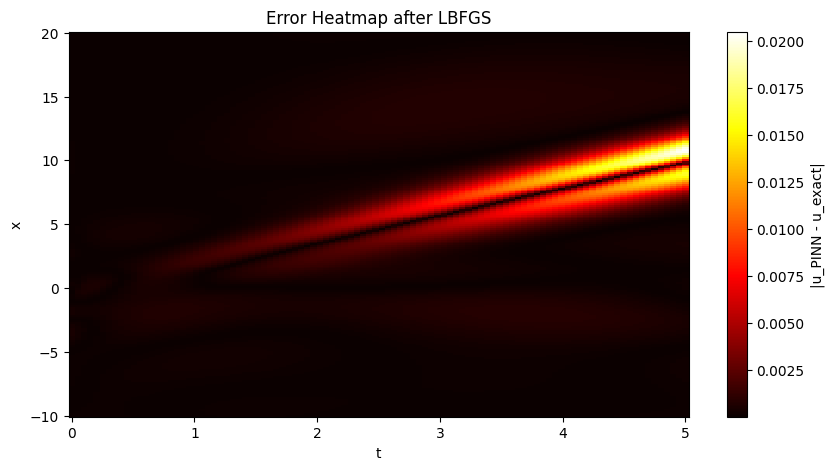

# Solving the KdV Equation using Physics-Informed Neural Networks

This project solves the Korteweg-de Vries (KdV) equation using a Physics-Informed Neural Network (PINN) and recovers the travelling wave (soliton) solution — without any training data.

Done as preliminary/informal work under **Prof. Snehanshu Saha**, BITS Pilani Goa.

**By:** Soham Pujari (2024A7PS0490G) and Nirek Agarwal (2024A7PS0581G)

---

## What is this?

The KdV equation describes how waves travel in shallow water. It has a special solution called a **soliton** — a wave that moves without changing shape, because the nonlinear steepening and dispersive spreading perfectly cancel each other out.

The equation (Section 4 sign convention from the reference paper):

```
∂u/∂t − 6u·∂u/∂x + ∂³u/∂x³ = 0
```

The exact soliton solution (Eq. 4.3 from the paper):

```
u(x,t) = −c / [2·cosh²(½√c · (x − ct))]
```

We pick `c = 2`, which gives a wave of depth 1 moving at speed 2.

The idea: instead of using the known formula, we train a neural network to figure out the solution on its own — purely from the equation and the initial wave shape. Then we compare its output against the exact formula to see how well it did.

---

## How it works

The neural network takes `(x, t)` as input and outputs a guess for the wave height `u`. We train it by minimizing three losses:

- **PDE loss** — plug the network's output into the KdV equation, check if it equals zero
- **IC loss** — at `t=0`, the network's output must match the known soliton shape
- **BC loss** — at the domain edges (`x=-10` and `x=20`), the wave height should be zero

No training data. The equation itself is the teacher.

---

## Our workflow

We built this step by step, verifying each piece before moving on.

### 1. Exact solution
Coded the soliton formula, plotted it at `t=0` to verify the shape (should be a dip centered at `x=0` with depth `-1`). Then plotted at multiple times to confirm the wave slides right at speed 2 without changing shape.




### 2. Neural network
Built a fully connected network: 2 inputs → 6 hidden layers of 50 neurons with tanh → 1 output. Xavier initialization. Tested with random inputs to make sure it runs.

### 3. Derivatives
Wrote a function to compute `∂u/∂t`, `∂u/∂x`, and `∂³u/∂x³` using PyTorch autograd. **Verified it independently** by comparing autograd derivatives against finite differences `(f(x+h) - f(x-h)) / 2h`. Max difference was ~0.001, confirming the implementation is correct.



### 4. Training — Adam
Trained for 15,000 iterations with Adam optimizer (lr=0.001). Loss dropped from ~0.64 to ~10⁻⁵, but the loss plot showed persistent oscillations — Adam was bouncing around the minimum without settling.

**Result:** L2 relative error = **2.24%**







### 5. Training — L-BFGS fine-tuning
Noticed the oscillations in the Adam loss plot and switched to L-BFGS (2000 iterations), which uses curvature information to take more precise steps. All losses dropped to ~10⁻⁷.

**Result:** L2 relative error = **0.98%**





### 6. Conservation check
Checked whether `∫u dx` stays constant over time — this is a conservation law of the KdV equation that we never told the network about. The integral stayed between -2.82 and -2.83 across all timesteps. The network learned a conservation law purely from the equation.

---

## Results summary

| Metric | Adam only | Adam + L-BFGS |
|---|---|---|
| L2 Relative Error | 2.24% | 0.98% |
| Total Loss | ~10⁻⁵ (oscillating) | ~10⁻⁷ (stable) |
| Conservation (∫u dx) | — | ~-2.82 (constant) |

---

## Repo structure

```
├── KdV_using_PINNs.ipynb    # the notebook (run top to bottom in Colab with T4 GPU)
├── README.md
├── 11_Schalch.pdf            # reference paper
└── screenshots/
    ├── soliton_t0.png
    ├── soliton_propagation.png
    ├── derivative_check.png
    ├── adam_results.png
    ├── adam_heatmap.png
    ├── adam_loss.png
    ├── lbfgs_results.png
    └── lbfgs_heatmap.png
```

---

## How to run

1. Open `KdV_using_PINNs.ipynb` in Google Colab
2. Go to Runtime → Change runtime type → T4 GPU
3. Run all cells top to bottom
4. Training takes ~15-20 minutes total (Adam + L-BFGS)

---

## Reference

Schalch, N. (2018). *The Korteweg-de Vries Equation.* ETH Zürich Proseminar: Algebra, Topology and Group Theory in Physics.

We used the soliton solution from Eq. 4.3 (Section 4 sign convention) and `c = 2`.
